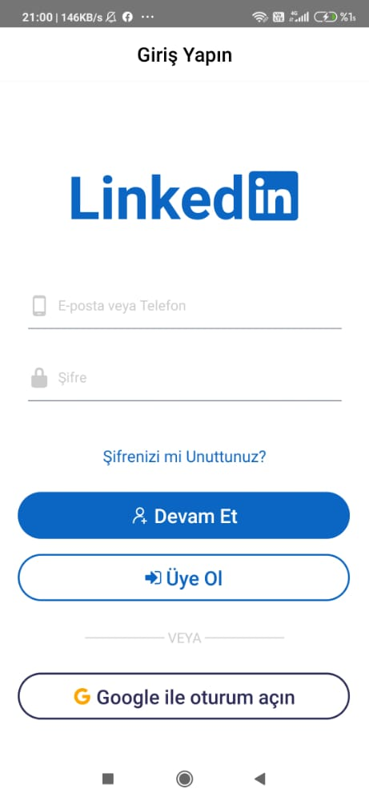
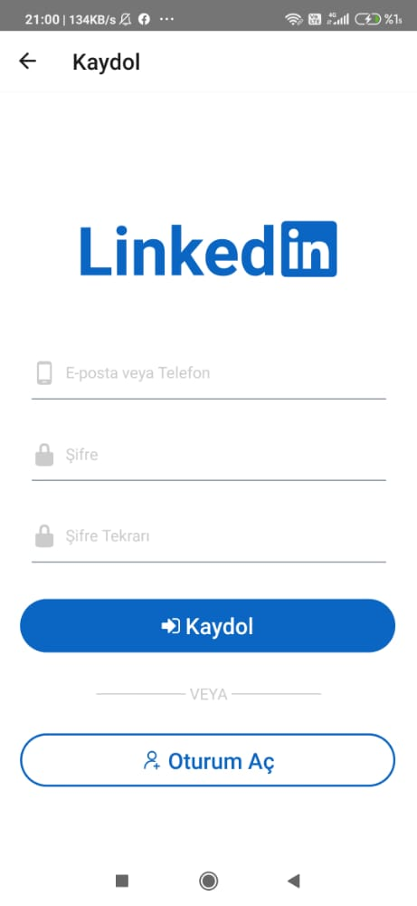
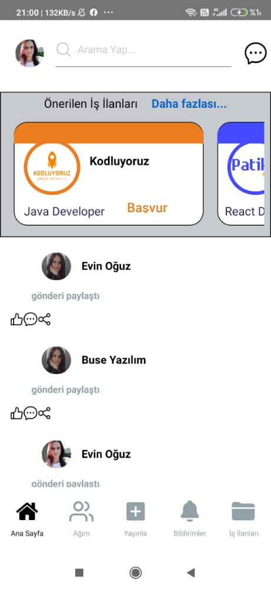
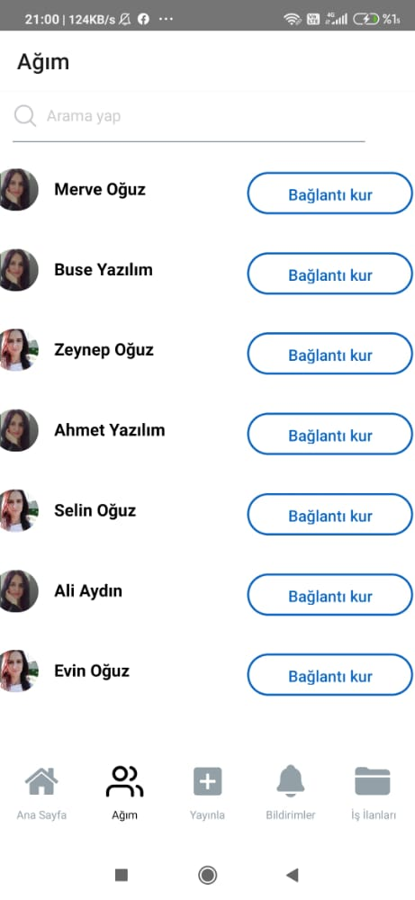
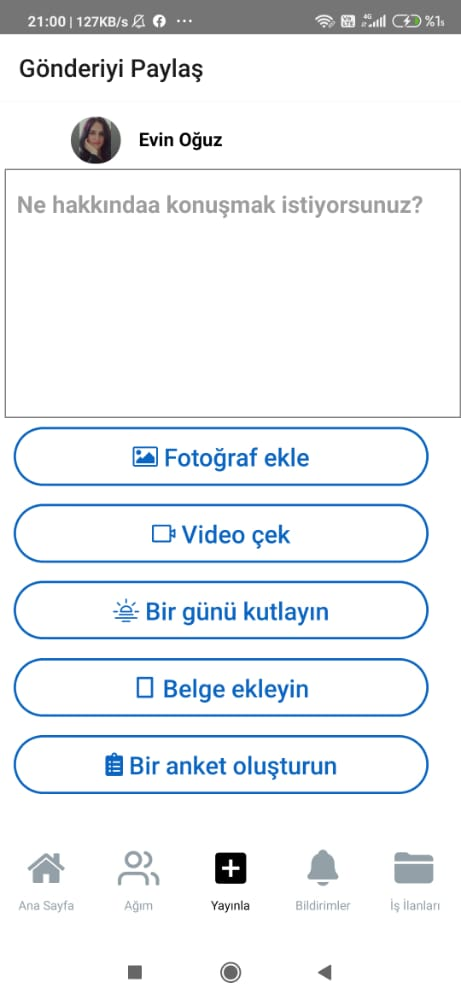
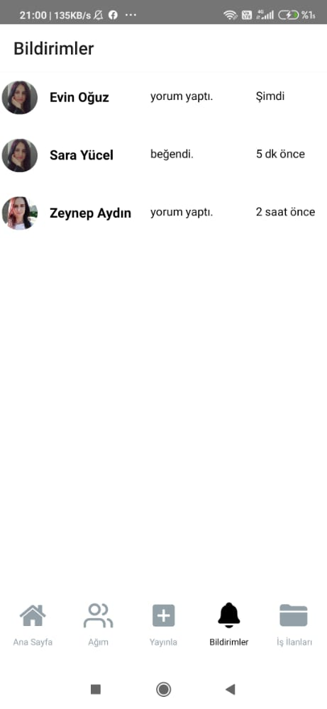
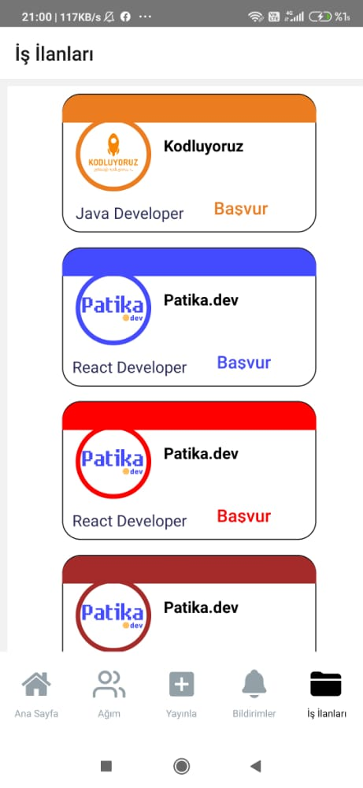

# Kodluyoruz Istanbul React Native Bootcamp Bitirme Projesi
 
 ### Linkedin uygulaması
 <div>








</div>
---
## Projenin Çalıştırılması
Proje indirilip

  Terminalde;
```
npm install

```
komut satırı ile projede kullanılan paketler "node_modules" klasöründe oluşturulur.
```
npx react-native start
```
komutu çalıştırılır, yeni terminal açılır;
```
npx react-native run-android
```
komutu ile proje çalıştırılır.
